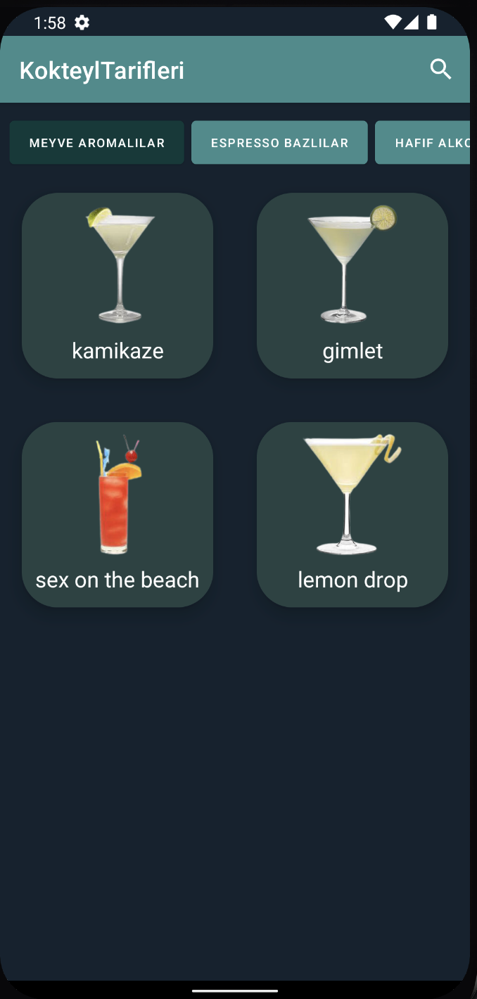
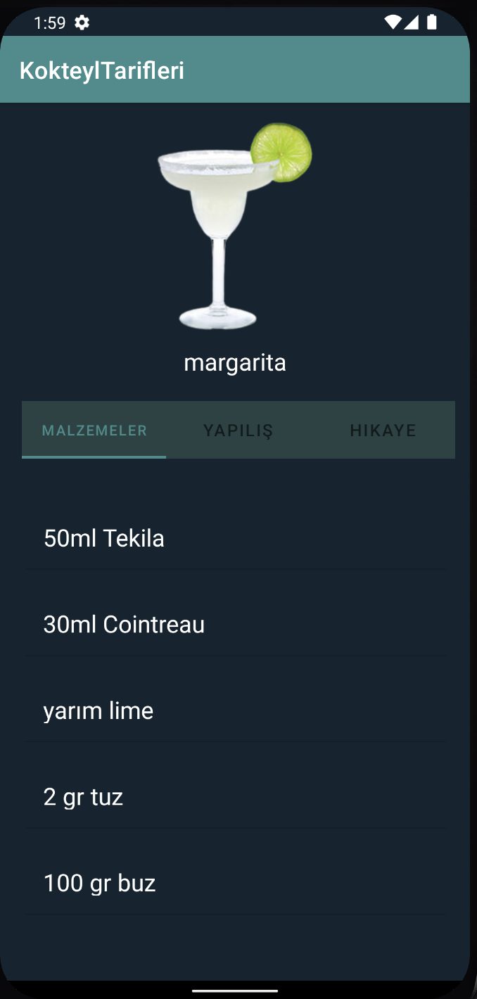

 <div id="top"></div>


<a href="https://www.android.com"></a>
<a href="https://kotlinlang.org"> </a>


| Popular | Top Rated |  Details
|:-:|:-:|:-:|
|  |  | 
| TV Show | Home Dark |  Menu Screen | Settings
|  |  | 


## Setup

### Requirements

- Java 8
- Latest version of Android SDK and Android Build Tools

### API Key

The app uses themoviedb.org API to get movie information and posters. You must provide your own [API key] in order to build the app (or you can use mine).

Just put your API key into the app module's `utils/constants` file (create the file if it does not exist already):

```kotlin
const val TMDb_API_KEY = "abc123"
```

## Components

* [Kotlin](https://kotlinlang.org/) based, [Coroutines](https://github.com/Kotlin/kotlinx.coroutines) + [Flow](https://kotlin.github.io/kotlinx.coroutines/kotlinx-coroutines-core/kotlinx.coroutines.flow/) for asynchronous programming.
* [Dagger Hilt](https://dagger.dev/hilt/) for dependency injection.
* [JetPack](https://developer.android.com/jetpack)
    + [DataStore]()
    + Room - construct a database using the abstract layer.
    + Worker - Updating data periodically when phone is idling
    + [Bindables](https://github.com/skydoves/bindables) - Android DataBinding kit for notifying data changes to UI layers.
+ Lifecycle - dispose of observing data when lifecycle state changes.
+ ViewModel - UI related data holder, lifecycle aware.
* Architecture
    + MVVM Architecture (View - DataBinding - ViewModel - Model)
* [Material 3](https://m3.material.io/) - Using Material Design 3
    + [Navigation Drawer](https://material.io/components/app-bars-bottom)
    + [Dark Mode Support](https://developer.android.com/guide/topics/ui/look-and-feel/darktheme) - Generate theme trough [Material Theme Builder](https://material-foundation.github.io/material-theme-builder/#/dynamic)
* [Retrofit2 & OkHttp3](https://github.com/square/retrofit) - construct the REST APIs and paging network data.
* [Glide](https://github.com/bumptech/glide) - loading images.
* [Material-Components](https://github.com/material-components/material-components-android) - Material design components like ripple animation, cardView.


## Scorecards


